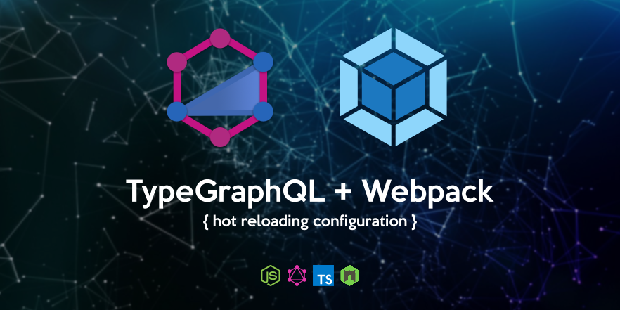
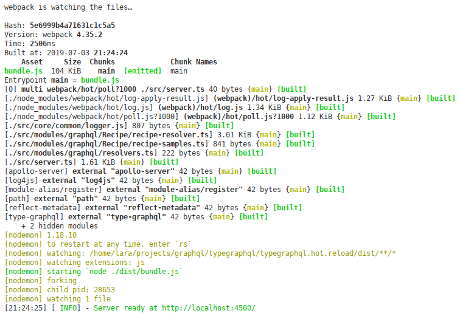
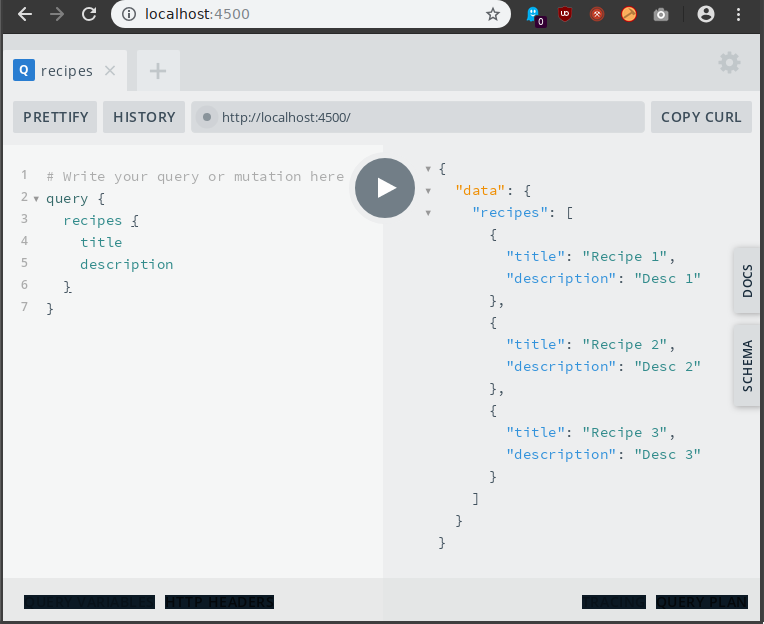
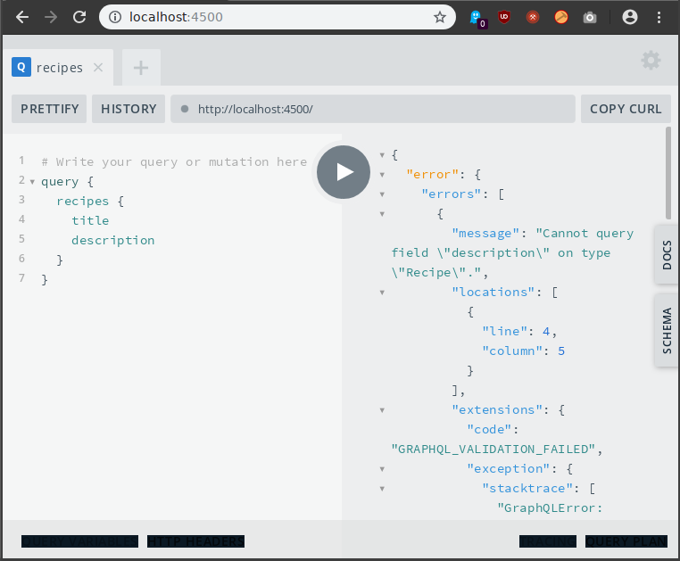

# Target

To configure a GraphQL API based on TypeGraphQL and Webpack in order to automate the *Hot Reload* when the code is edited.

# Modules involved

## TypeGraphQL

The basic demanded modules in order to build a project based on this library (check its [Installation](https://typegraphql.ml/docs/installation.html) section).

## Webpack 4

### Basic

- [Webpack](https://www.npmjs.com/package/webpack)
- [Clean Webpack Plugin](https://www.npmjs.com/package/clean-webpack-plugin)
- [Webpack Merge](https://www.npmjs.com/package/webpack-merge)
- [Webpack Node Externals](https://www.npmjs.com/package/webpack-node-externals)

### Needed for Hot Reloading

- [Nodemon Webpack Plugin](https://www.npmjs.com/package/nodemon-webpack-plugin)

### Optional

- [Dotenv Webpack](https://www.npmjs.com/package/dotenv-webpack)

# How does it work?

The most important part in order to automate the hot reloading process is the definition of the *Nodemon Webpack Plugin* located at the [webpack.dev.js](https://github.com/ddialar/typegraphql.hot.reload/blob/master/webpack/webpack.dev.js), *plugins* section.

```json
new NodemonPlugin({
    watch: path.resolve('./dist'),
    script: './dist/bundle.js',
    verbose: true,
    ext: 'js'
}),
```

This way, Nodemon is going to be tracking the compiled file and this module will be in charge to manage the server reloading after every change in the code.

# How to check it?

1. Clone the repository and install its dependencies.

    ```sh
    $ git clone https://github.com/ddialar/typegraphql.hot.reload
    $ cd typegraphql.hot.reload
    $ npm i
    ```

2. Run the server.

    ```sh
    $ npm run build:dev
    ```

    You will get something like that:

    

3. Surf to the [http://localhost:4500/](http://localhost:4500/) URL and run the next query in the Playground environment:

    ```graphql
    query {
        recipes {
            title
            description
        }
    }
    ```

    

4. Open the `recipe-resolver.ts` file and edit the `recipes()` resolver commenting the line number #25. Save the code and check that the server has been reloaded.

5. Run the Playground's query again and you will see that at this time, the `[TRACE]` comment doesn't appear.

6. Now open the `recipe-type.ts` file and edit the `Recipe` class commenting the `description` field (lines #12 and #13).

    ```ts
    import {
        Field,
        ObjectType,
        Int
    } from 'type-graphql';

    @ObjectType()
    class Recipe {
        @Field()
        title: string = "";

        // @Field({ nullable: true, description: 'The recipe description with preparation info.' })
        // description?: string;

        @Field(type => [Int])
        ratings: number[] = [];
        
        @Field()
        creationData: Date = new Date();
    }

    export default Recipe;
    ```

    Save the code and check that the server has been reloaded.

7. Run the Playground's query again and you will receive an error due to the `description` field is not defined.

    